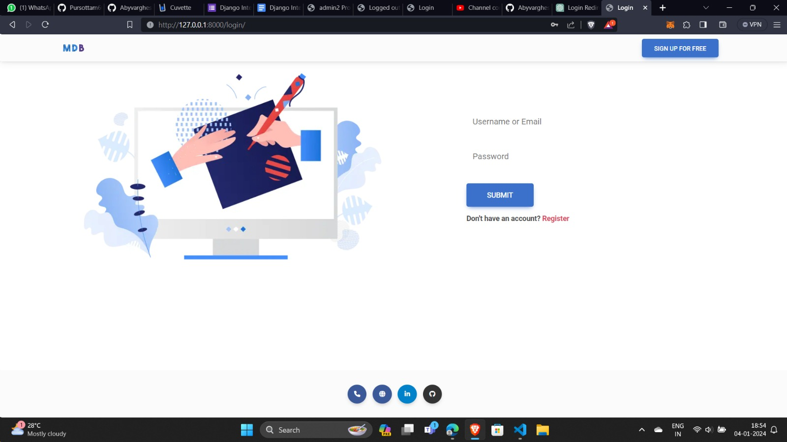
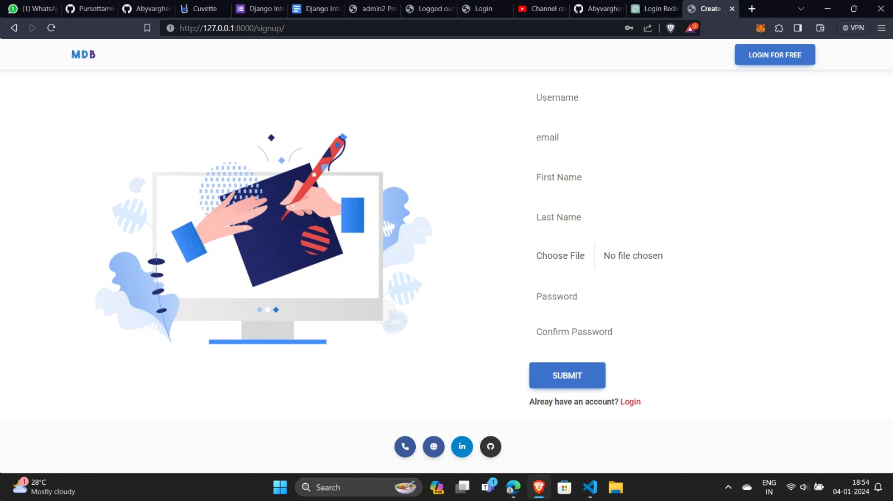
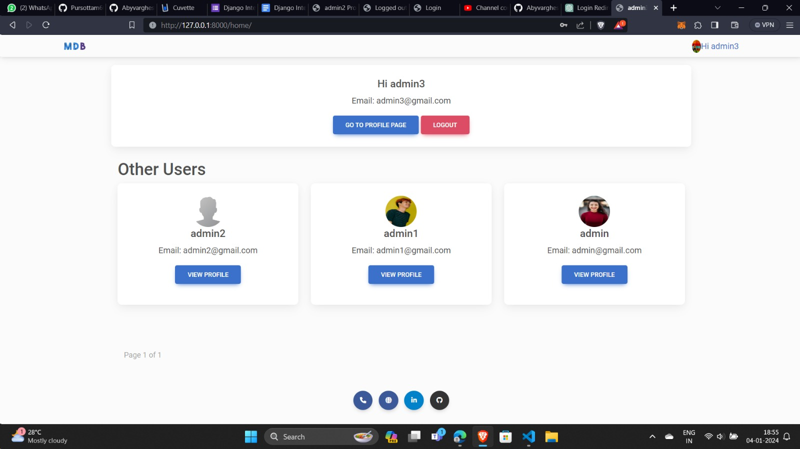
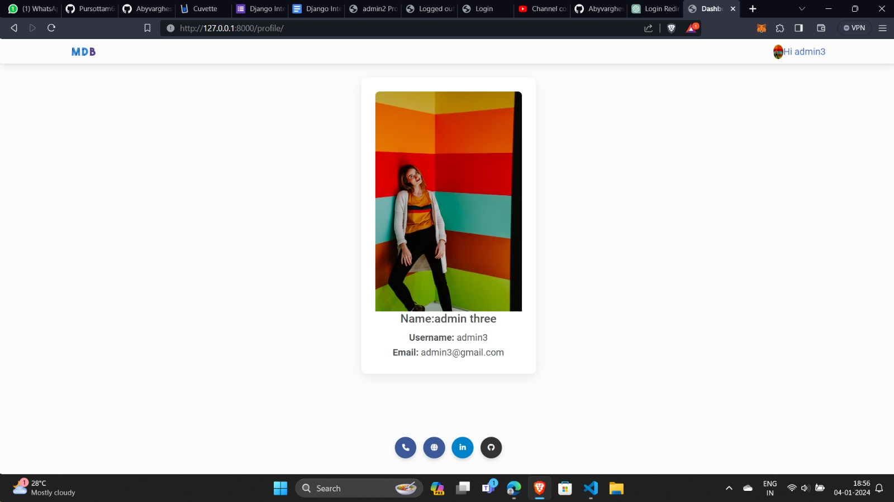
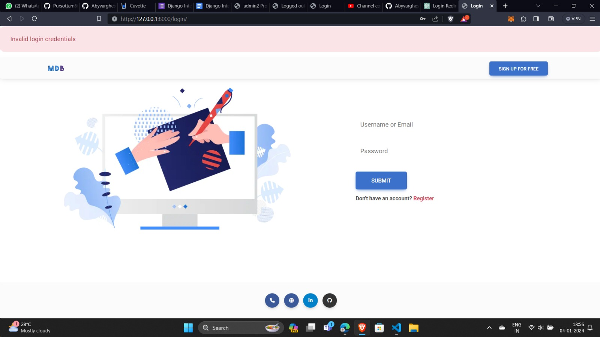
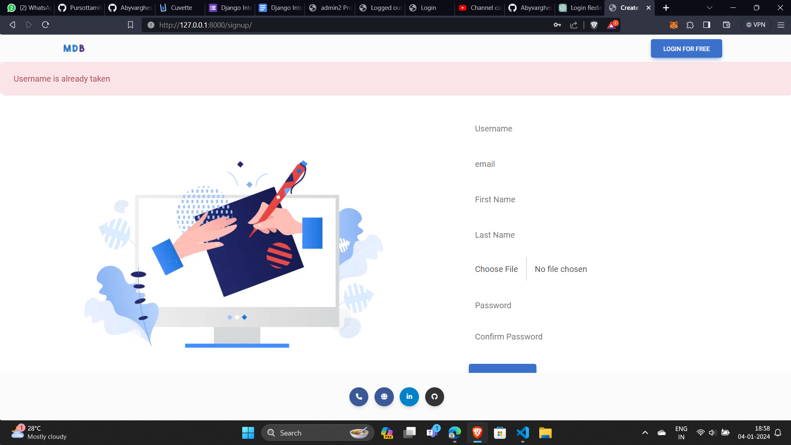

# Endpoints

Login
http://127.0.0.1:8000/login/

Signup
http://127.0.0.1:8000/signup/

dashboard
http://127.0.0.1:8000/home/

profile
http://127.0.0.1:8000/profile/

Other Users( Profile)


# Run project

1) Clone the repository
https://github.com/AbyvargheseMandapathel/cuvette_task.git

2) Create and activate virtual environment

``` bash
    python -m venv myvenv
    virtualenv env
    .\env\Scripts\Activate.ps1 
```

3) Install dependencies:

```bash
    pip install -r requirements.txt
```

4)Apply migrations:

```bash
    python manage.py makemigrations
    python manage.py migrate
```

5)Run the development server:

```bash
    python manage.py runserver
```

# Screenshots
Login


SignUp


Dashboard


Profile Page


Validation - Login Page


Validation - SignUp

